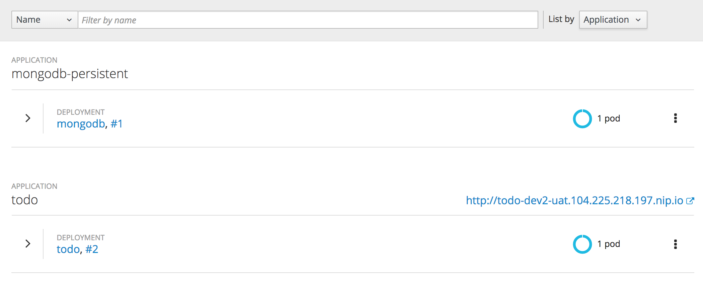

# Configure the CI/CD pipeline
## Setup the UAT environment
### Create a project for UAT. 
For the purposes of this workshop, the project should be named after the following convention:

dev${your number}-uat

### Give the "jenkins" service account the ability to invoke deployments in the UAT environment

oc policy add-role-to-user edit system:serviceaccount:dev1:jenkins -n dev1-uat 

### Give the default service account access to images in DEV environment

Important: in the command below, change the namespace "dev1-uat" to your uat project name and "dev1" to your dev project name.

```
oc policy add-role-to-user system:image-puller system:serviceaccount:dev1-uat:default --namespace=dev1
```

### Import the following templates

- Using a notepad or vi, create a file named uat.yaml and paste the below contents to this file and save.
- Ensure you are in the uat project by checking what project you are in using the command


```
apiVersion: v1
kind: Template
metadata:
  creationTimestamp: null
  name: uat
objects:
- apiVersion: v1
  kind: PersistentVolumeClaim
  metadata:
    labels:
      app: mongodb-persistent
      template: mongodb-persistent-template
    name: mongodb
  spec:
    accessModes:
    - ReadWriteOnce
    resources:
      requests:
        storage: 1Gi
- apiVersion: v1
  kind: ImageStream
  metadata:
    labels:
      app: todo
    name: todo
  spec:
    lookupPolicy:
      local: false
    tags:
    - annotations: null
      from:
        kind: DockerImage
        name: 172.30.1.1:5000/dev1/todo:latest
      generation: null
      importPolicy: {}
      name: latest
      referencePolicy:
        type: ""
- apiVersion: v1
  data:
    database-admin-password: ZGVtbw==
    database-name: dG9kby1hcGk=
    database-password: ZGVtbw==
    database-user: ZGVtbw==
  kind: Secret
  metadata:
    annotations:
      template.openshift.io/expose-admin_password: '{.data[''database-admin-password'']}'
      template.openshift.io/expose-database_name: '{.data[''database-name'']}'
      template.openshift.io/expose-password: '{.data[''database-password'']}'
      template.openshift.io/expose-username: '{.data[''database-user'']}'
    labels:
      app: mongodb-persistent
      template: mongodb-persistent-template
    name: mongodb
  type: Opaque
- apiVersion: v1
  kind: DeploymentConfig
  metadata:
    labels:
      app: mongodb-persistent
      template: mongodb-persistent-template
    name: mongodb
  spec:
    replicas: 1
    selector:
      name: mongodb
    strategy:
      activeDeadlineSeconds: 21600
      recreateParams:
        timeoutSeconds: 600
      resources: {}
      type: Recreate
    template:
      metadata:
        creationTimestamp: null
        labels:
          name: mongodb
      spec:
        containers:
        - env:
          - name: MONGODB_USER
            valueFrom:
              secretKeyRef:
                key: database-user
                name: mongodb
          - name: MONGODB_PASSWORD
            valueFrom:
              secretKeyRef:
                key: database-password
                name: mongodb
          - name: MONGODB_ADMIN_PASSWORD
            valueFrom:
              secretKeyRef:
                key: database-admin-password
                name: mongodb
          - name: MONGODB_DATABASE
            valueFrom:
              secretKeyRef:
                key: database-name
                name: mongodb
          image: centos/mongodb-32-centos7@sha256:a8186548488e545a7384913a3ea0503a4427b92cf17def2b5f60037180576b7c
          imagePullPolicy: IfNotPresent
          livenessProbe:
            failureThreshold: 3
            initialDelaySeconds: 30
            periodSeconds: 10
            successThreshold: 1
            tcpSocket:
              port: 27017
            timeoutSeconds: 1
          name: mongodb
          ports:
          - containerPort: 27017
            protocol: TCP
          readinessProbe:
            exec:
              command:
              - /bin/sh
              - -i
              - -c
              - mongo 127.0.0.1:27017/$MONGODB_DATABASE -u $MONGODB_USER -p $MONGODB_PASSWORD
                --eval="quit()"
            failureThreshold: 3
            initialDelaySeconds: 3
            periodSeconds: 10
            successThreshold: 1
            timeoutSeconds: 1
          resources:
            limits:
              memory: 512Mi
          securityContext:
            capabilities: {}
            privileged: false
          terminationMessagePath: /dev/termination-log
          terminationMessagePolicy: File
          volumeMounts:
          - mountPath: /var/lib/mongodb/data
            name: mongodb-data
        dnsPolicy: ClusterFirst
        restartPolicy: Always
        schedulerName: default-scheduler
        securityContext: {}
        terminationGracePeriodSeconds: 30
        volumes:
        - name: mongodb-data
          persistentVolumeClaim:
            claimName: mongodb
    test: false
    triggers:
    - imageChangeParams:
        automatic: true
        containerNames:
        - mongodb
        from:
          kind: ImageStreamTag
          name: mongodb:3.2
          namespace: openshift
      type: ImageChange
    - type: ConfigChange
- apiVersion: v1
  kind: DeploymentConfig
  metadata:
    labels:
      app: todo
    name: todo
  spec:
    replicas: 1
    selector:
      deploymentconfig: todo
    strategy:
      activeDeadlineSeconds: 21600
      resources: {}
      rollingParams:
        intervalSeconds: 1
        maxSurge: 25%
        maxUnavailable: 25%
        timeoutSeconds: 600
        updatePeriodSeconds: 1
      type: Rolling
    template:
      metadata:
        creationTimestamp: null
        labels:
          app: todo
          deploymentconfig: todo
      spec:
        containers:
        - env:
          - name: PORT
            value: "8080"
          image: 172.30.1.1:5000/dev1/todo
          imagePullPolicy: Always
          name: todo
          ports:
          - containerPort: 8080
            protocol: TCP
          resources: {}
          terminationMessagePath: /dev/termination-log
          terminationMessagePolicy: File
        dnsPolicy: ClusterFirst
        restartPolicy: Always
        schedulerName: default-scheduler
        securityContext: {}
        terminationGracePeriodSeconds: 30
    test: false
    triggers:
    - imageChangeParams:
        automatic: true
        containerNames:
        - todo
        from:
          kind: ImageStreamTag
          name: todo:latest
          namespace: dev1
      type: ImageChange
    - type: ConfigChange
- apiVersion: v1
  kind: Service
  metadata:
    labels:
      app: mongodb-persistent
      template: mongodb-persistent-template
    name: mongodb
  spec:
    ports:
    - name: mongo
      port: 27017
      protocol: TCP
      targetPort: 27017
    selector:
      name: mongodb
    sessionAffinity: None
    type: ClusterIP
- apiVersion: v1
  kind: Service
  metadata:
    labels:
      app: todo
    name: todo
  spec:
    ports:
    - name: 8080-tcp
      port: 8080
      protocol: TCP
      targetPort: 8080
    selector:
      deploymentconfig: todo
    sessionAffinity: None
    type: ClusterIP
```  
- Ensure you are in the uat project by checking the output of the command below:

```
oc project
```

- Import the template 

```
oc create -f uat.yaml
```
This will give an output similar to:

```
template "uat" created
```

- Create a new application based on the template

```
oc create -f uat
```
This will give an output similar to 

```
[root@bcorpus2 bobby]# oc new-app uat
--> Deploying template "dev2-uat/uat" to project dev2-uat

--> Creating resources ...
    persistentvolumeclaim "mongodb" created
    imagestream "todo" created
    secret "mongodb" created
    deploymentconfig "mongodb" created
    deploymentconfig "todo" created
    service "mongodb" created
    service "todo" created
--> Success
    Application is not exposed. You can expose services to the outside world by executing one or more of the commands below:
     'oc expose svc/mongodb' 
     'oc expose svc/todo' 
    Run 'oc status' to view your app.
```



## Configure the GitHook

- Login to Jenkins as your user id.
- Click on your UserId at the upper right hand corner.
- Click on Configure at the left hand navigation bar.
- Click on Show API Token. Take note of the "User ID" and "API Token".
- Go to gogs page. Access the todoAPIjs repository -> Settings -> Git Hooks -> Post Receive. Paste the following script after substituting the user id and api token you got from Jenkins. The url should also be correct. Instructor will show how to get the correct URL.

```
#!/bin/bash
while read oldrev newrev ref
do
    if [[ $ref =~ refs/tags ]];
    then
        echo "Master ref received.  Deploying master branch to production..."
        TAG=`echo $ref|sed 's#refs/tags/\(.*\)#\1#g'`
        curl -v -k --user <userid>:<api token> -G "https://jenkins-todo-dev.10.1.2.2.nip.io/job/todo-dev-todo-pipeline/buildWithParameters" -d token=secret -d commit=$newrev -d tag=$TAG
    else
        echo "Ref $ref successfully received.  Doing nothing: only the master branch may be deployed on this server."
    fi
done
```
