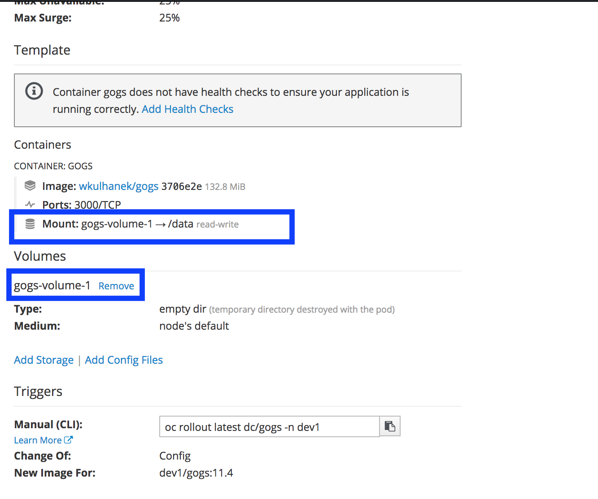
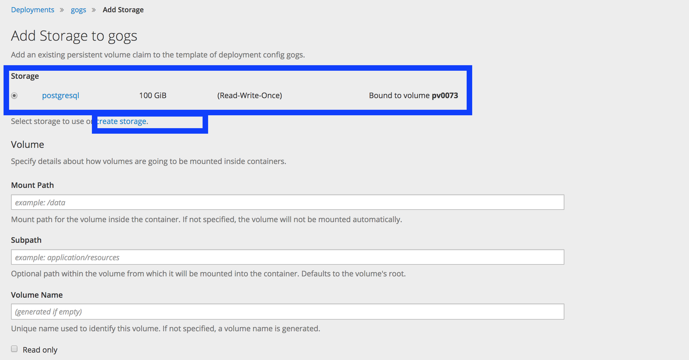
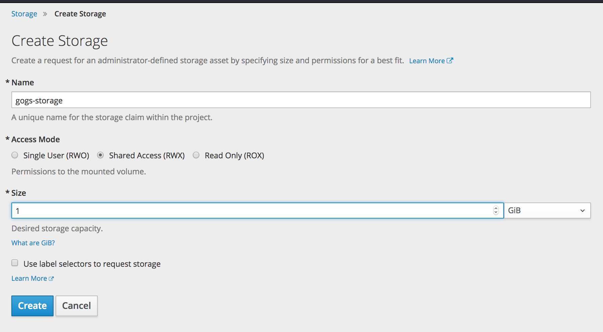
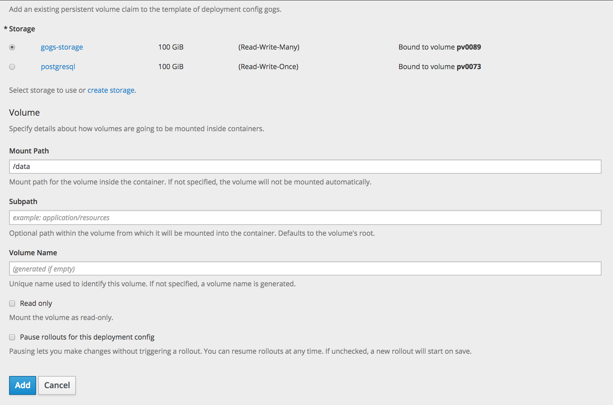

# Running your own Git Service 
## Run the Go Git Service image using the command below

```
oc new-app wkulhanek/gogs:11.4
```

## Attach storage to gogs and mount to /data

We are going to replace the "non-persistent" volume mounted on /data and change it to a persistent volume. Go to Applications->Deployments->gogs->Configuration. Scroll down to volumes and delete the volume mounted on /data.



Click on Add Storage. 



You'll notice there is only one storage and it's already claimed by another container. We need to create another storage. Click on 'create storage' and input the following details as show below:



Mount gogs-storage to /data and click Add



## Configure the gogs database by accessing the gogs url. TODO: Add detailed steps.
## Get the contents of /opt/gogs/custom/conf/app.ini
```
[root@openshift todoAPIjs]# oc project gogs
[root@openshift todoAPIjs]# oc get pods
NAME                 READY     STATUS    RESTARTS   AGE
gogs-3-t3wqs         1/1       Running   0          9h
postgresql-1-7969q   1/1       Running   0          10h
```
- Take note of the pod and get the contents of /opt/gogs/custom/conf/app.ini.
```
oc rsh gogs-3-t3wqs cat /opt/gogs/custom/conf/app.ini
```

- Create a config map with key "app.ini" and value equal to the contents of /opt/gogs/custom/conf/app.ini. This will redeploy the gogs application. TODO: Add detailed steps.
