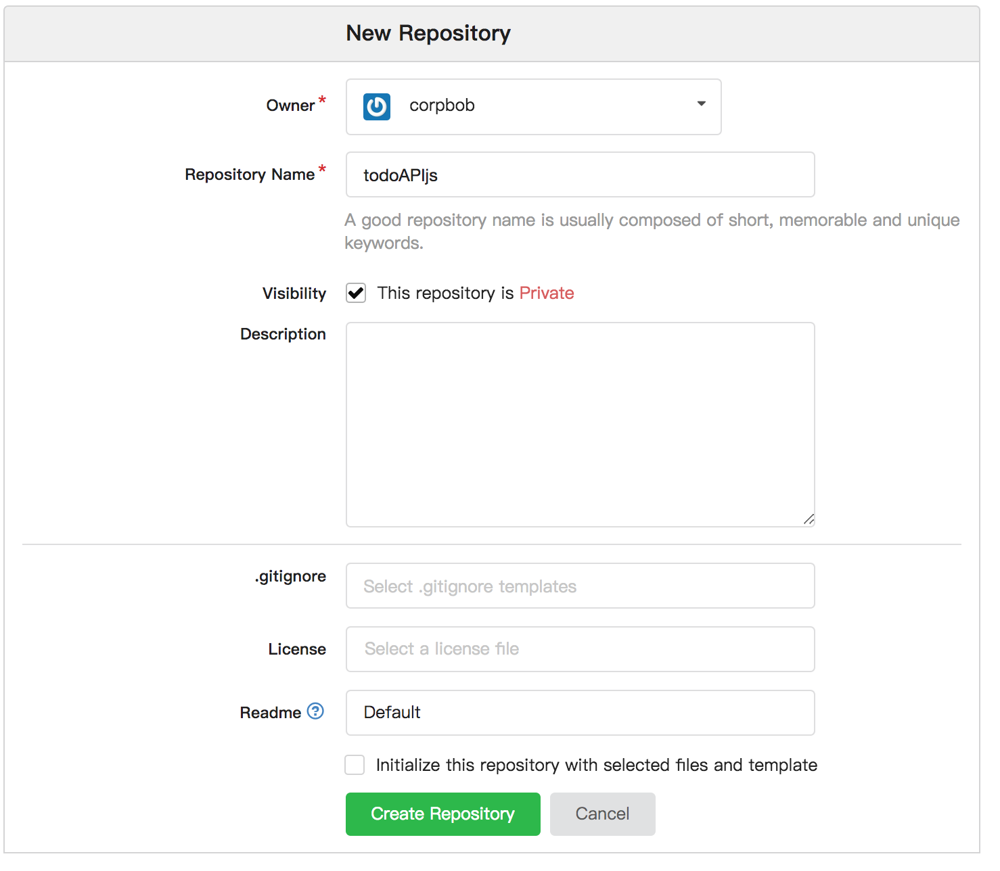
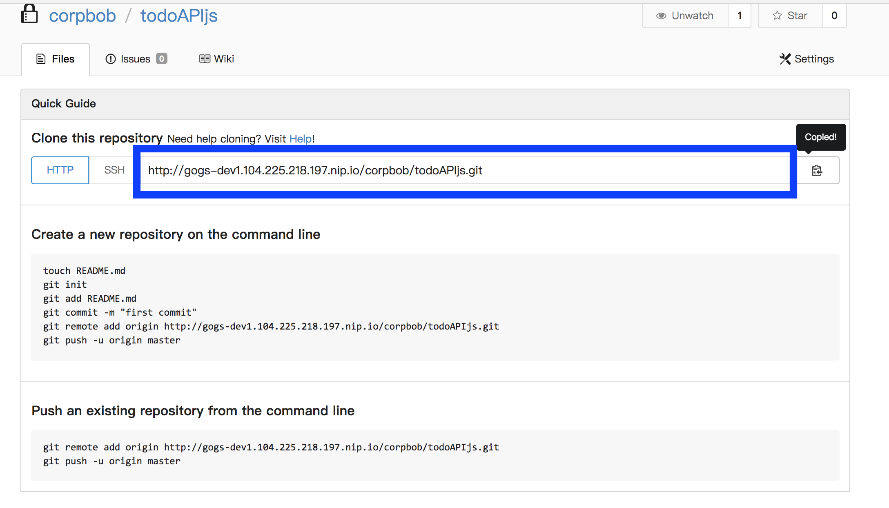
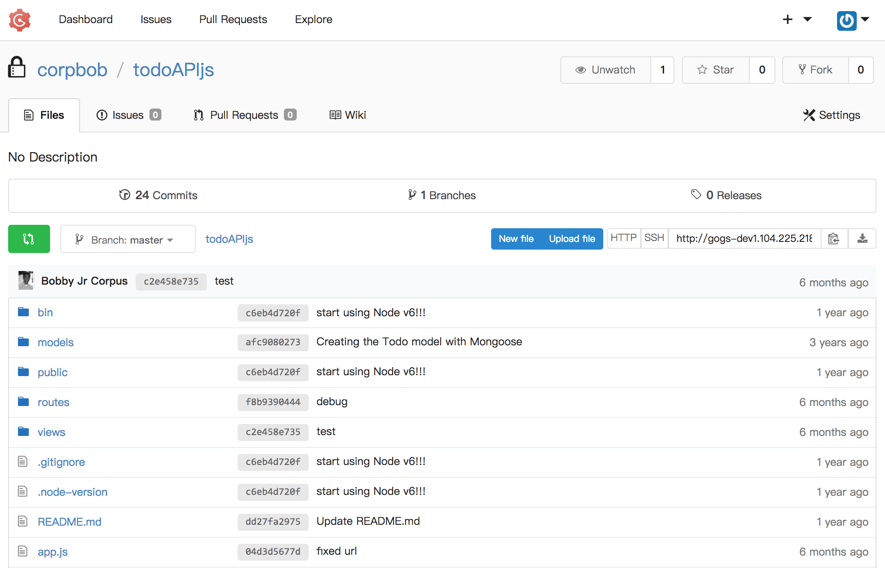
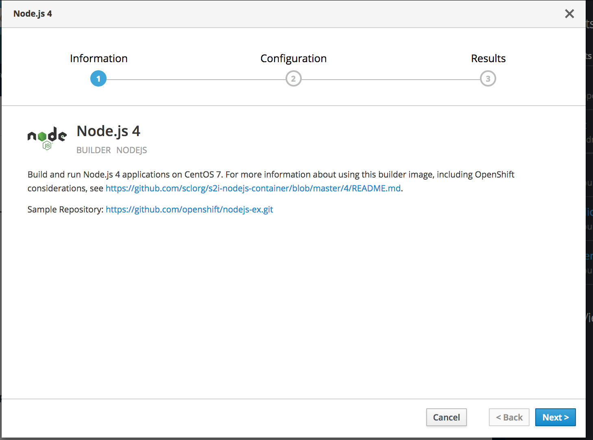
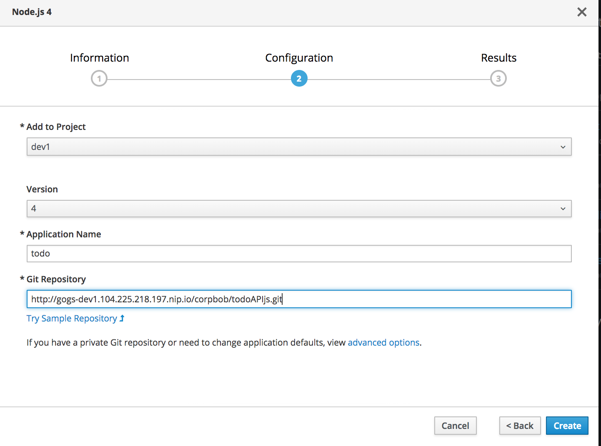

# Using Jenkins Pipeline

## Register to Gogs 

First we need to register to Gogs as a developer.


## Create a new Repository

Click the + sign of My Repositories. Set the following details:

- Repository Name = todoAPIjs
- Visibility = Private

Click Create Repository



Copy the new repository url to the clipboard



## Import source code to the Repository

- Clone the application https://github.com/corpbob/todoAPIjs.git
```
git clone https://github.com/corpbob/todoAPIjs.git
```
- Add a new remote 
```
cd todoAPIjs
git remote add gogs <your gogs todoAPIjs repository url>
git push gogs master
```
You should be able to see something like this



## Create a new application using NodeJs template

Click "Add to Project", search for NodeJs



Input the details as shown below. The project should be the project assigned to you.



Click on Create.

The build will fail in this case because the repository is private.

## Add Gogs credentials to your OpenShift project


- Make sure you are in the correct project

```
oc project
```

- Create basic secret by specifying your username and password to gogs. In the command below, substitute your gogs username and gogs password.
```
oc secrets new-basicauth  gogs-secret --username=<your gogs username> --password=<your gogs password>
```
Configure the deployment config to use this secret. 

- Go to Builds->Builds->todo


