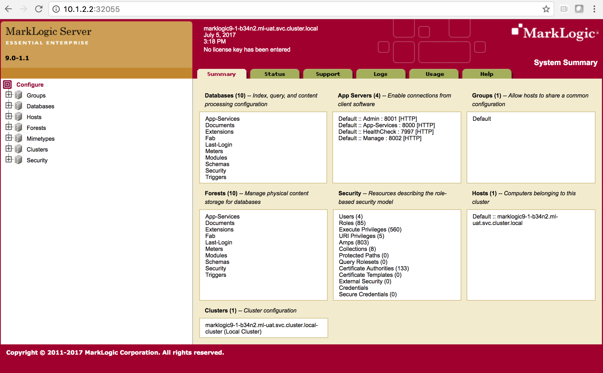

# How to Expose the Admin and Query Console

## Assumptions
- You have installed the MarkLogic CI/CD as found in these instructions [openshift_marklogic_cicd.md](openshift_marklogic_cicd.md)
- MarkLogic server is up and running.
- You are using ml-dev namespace

## Get the ml-dev deployment config name of marklogic
```
[root@openshift ~]# oc get dc -n ml-dev
NAME                  REVISION   DESIRED   CURRENT   TRIGGERED BY
marklogic9            1          1         1         config,image(marklogic9:latest)
slush-marklogic-app   1          1         1         config,image(slush-marklogic-app:latest)
```

## Expose the Deployment Config of MarkLogic
```
oc expose dc marklogic9 --type=LoadBalancer --name=ml-ingress -n ml-dev
```
This will create a new service called ml-ingress with an external ip address

```
[root@openshift ~]# oc get svc -n ml-uat
NAME                  CLUSTER-IP       EXTERNAL-IP                   PORT(S)                                                                                                                                                                                                AGE
marklogic             172.30.178.120   <none>                        7997/TCP,7998/TCP,7999/TCP,8000/TCP,8001/TCP,8002/TCP,8004/TCP,8005/TCP,8040/TCP,8041/TCP,30050/TCP,30051/TCP,8070/TCP                                                                                 1d
ml-ingress            172.30.188.214   172.29.39.114,172.29.39.114   7997:31953/TCP,7998:32560/TCP,8004:30889/TCP,8041:31343/TCP,30050:30243/TCP,30051:31112/TCP,8000:31305/TCP,8005:30691/TCP,8040:32358/TCP,7999:31518/TCP,8001:32055/TCP,8002:32331/TCP,8070:32607/TCP   2m
slush-marklogic-app   172.30.38.134    <none>                        3000/TCP                                                                                                                                                   
```

##

```
[root@openshift ~]# oc export svc ml-ingress -n ml-dev
apiVersion: v1
kind: Service
metadata:
  creationTimestamp: null
  labels:
    app: marklogic9
  name: ml-ingress
spec:
  deprecatedPublicIPs:
  - 172.29.39.114
  externalIPs:
  - 172.29.39.114
  ports:
  - name: port-1
    nodePort: 31953
    port: 7997
    protocol: TCP
    targetPort: 7997
  - name: port-2
    nodePort: 32560
    port: 7998
    protocol: TCP
    targetPort: 7998
  - name: port-3
    nodePort: 30889
    port: 8004
    protocol: TCP
    targetPort: 8004
  - name: port-4
    nodePort: 31343
    port: 8041
    protocol: TCP
    targetPort: 8041
  - name: port-5
    nodePort: 30243
    port: 30050
    protocol: TCP
    targetPort: 30050
  - name: port-6
    nodePort: 31112
    port: 30051
    protocol: TCP
    targetPort: 30051
  - name: port-7
    nodePort: 31305
    port: 8000
    protocol: TCP
    targetPort: 8000
  - name: port-8
    nodePort: 30691
    port: 8005
    protocol: TCP
    targetPort: 8005
  - name: port-9
    nodePort: 32358
    port: 8040
    protocol: TCP
    targetPort: 8040
  - name: port-10
    nodePort: 31518
    port: 7999
    protocol: TCP
    targetPort: 7999
  - name: port-11
    nodePort: 32055
    port: 8001
    protocol: TCP
    targetPort: 8001
  - name: port-12
    nodePort: 32331
    port: 8002
    protocol: TCP
    targetPort: 8002
  - name: port-13
    nodePort: 32607
    port: 8070
    protocol: TCP
    targetPort: 8070
  selector:
    app: marklogic9
    deploymentconfig: marklogic9
  sessionAffinity: None
  type: LoadBalancer
status:
  loadBalancer: {}
```

## Get the nodePort of the admin console from the listing above. In this example, the nodePort=32055. You can do a curl to this port to access the admin console.

```
[root@openshift ~]# curl -v http://10.1.2.2:32055
* About to connect() to 10.1.2.2 port 32055 (#0)
*   Trying 10.1.2.2...
* Connected to 10.1.2.2 (10.1.2.2) port 32055 (#0)
> GET / HTTP/1.1
> User-Agent: curl/7.29.0
> Host: 10.1.2.2:32055
> Accept: */*
> 
< HTTP/1.1 401 Unauthorized
< Server: MarkLogic
< WWW-Authenticate: Digest realm="public", qop="auth", nonce="4b707e317fde11fa4c1cf31879451bbf", opaque="83ced25ba4b28df6"
< Content-Type: text/html; charset=utf-8
< Content-Length: 209
< Connection: Keep-Alive
< Keep-Alive: timeout=5
< 
<html xmlns="http://www.w3.org/1999/xhtml">
  <head>
    <title>401 Unauthorized</title>
    <meta name="robots" content="noindex,nofollow"/>
  </head>
  <body>
    <h1>401 Unauthorized</h1>
  </body>
</html>
* Connection #0 to host 10.1.2.2 left intact
```

The "Unauthorized" response came from MarkLogic admin console.

## Open the firewall so you can use a browser to view the Admin Console.

```
firewall-cmd --zone public --add-port 32055/tcp --permanent
```

## Create a new iptables rule that will correctly forward the packets to docker.

```
firewall-cmd --direct --add-rule ipv4 filter FORWARD 3 -i enp0s8 -o docker0 -j ACCEPT
```

## Make the iptables rule persistent. Create a file /etc/firewalld/direct.xml with the following contents:

```
<?xml version="1.0" encoding="utf-8"?>
<direct>
   [ <rule ipv="ipv4" table="filter" chain="FORWARD_direct" priority="0"> -i enp0s8 -o docker0 -j ACCEPT </rule> ]
</direct>
```
## Launch your browser and navigate to http://10.1.2.2:32055. You should get the MarkLogic Admin Console. The same process applies to get the Query Console.




