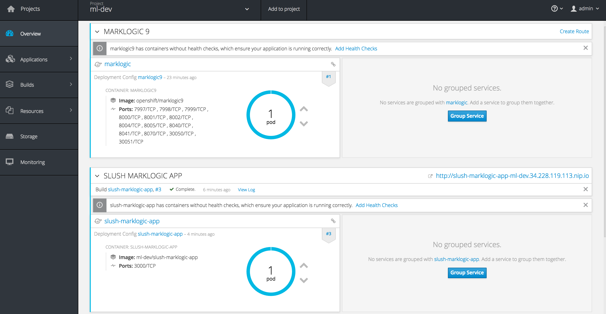
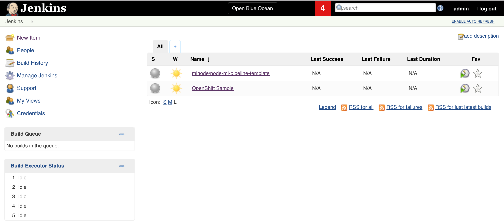
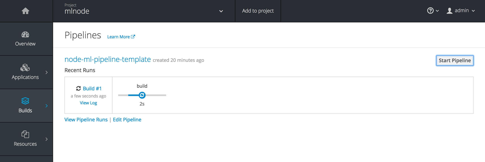
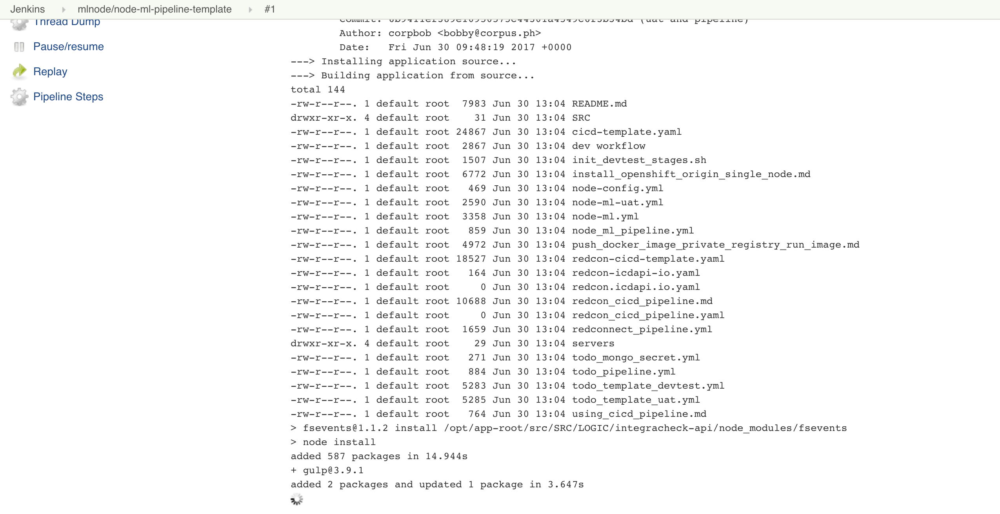

# How to Develop MarkLogic Applications in OpenShift

## Assumptions

- You are logged in to OpenShift as admin

```
[root@openshiftdev OpenShiftHowToGuides]# oc whoami
admin
```

- If not, then log in as admin

```
[root@openshiftdev ~]# oc login -u admin
Logged into "https://10.0.2.15:8443" as "admin" using existing credentials.

You have access to the following projects and can switch between them with 'oc project <projectname>':

  * default
    kube-system
    myproject
    openshift
    openshift-infra

Using project "default".
```

## Build the MarkLogic 9 Docker Image 

- Instructions are here [build_marklogic_docker_image](build_marklogic_docker_image.md)

## Push the MarkLogic Docker image to OpenShift namespace

- Tag it first

```
docker tag marklogic9 172.30.1.1:5000/openshift/marklogic9
```

- Login to internal docker registry
```
docker login -u admin -p $(oc whoami -t) 172.30.1.1:5000
```

- Push the image 
```
[root@openshiftdev ~]# docker push 172.30.1.1:5000/openshift/marklogic9
The push refers to a repository [172.30.1.1:5000/openshift/marklogic9]
ed592544bda0: Pushed 
c4d1a54cbe8c: Pushed 
109dc775307d: Pushed 
12d0ed825c00: Pushed 
a2183695d4bf: Pushed 
88fee9aaa960: Pushed 
dc1e2dcdc7b6: Layer already exists 
latest: digest: sha256:47319f54d674621a27ea90dc6c86edb0fe3db0b20184bf3b9a91b417e3f8f1ea size: 9964

```
- This should create an ImageStream in the openshift namespace. You can check this by issuing the command:

```
[root@openshiftdev OpenShiftHowToGuides]# oc get is -n openshift|grep marklogic
marklogic9   172.30.1.1:5000/openshift/marklogic9   latest                         About a minute ago
```

- You can view the contents of the ImageStream config file by issuing this command:

```
[root@openshiftdev ~]# oc export is marklogic9 -n openshift
apiVersion: v1
kind: ImageStream
metadata:
  creationTimestamp: null
  generation: 1
  name: marklogic9
spec:
  tags:
  - annotations: null
    from:
      kind: DockerImage
      name: 172.30.1.1:5000/openshift/marklogic9:latest
    generation: null
    importPolicy: {}
    name: latest
    referencePolicy:
      type: ""
status:
  dockerImageRepository: ""
```
## Build the slush-marklogic-node Source-2-Image Docker Image 
- Instructions are here [build_slush_marklogic_node_docker_s2i_image.md](build_slush_marklogic_node_docker_s2i_image.md)

## Create DEV environment

- Download the file [slush-marklogic-node-templatel.yml](marklogic/slush-marklogic-node-templatel.yml)
- Create dev project

```
oc new-project ml-dev
```

- Allow MarkLogic to run as root user.
```
oc adm policy add-scc-to-user anyuid -z default
```

- Save the docker credentials for pushing and pulling
```
oc secrets new-dockercfg push-secret --docker-server=172.30.1.1:5000 --docker-username=admin --docker-password=$(oc whoami -t) --docker-email=admin@example.com
oc secrets add serviceaccount/default secrets/push-secret --for=pull,mount
```

- Import the template
```
oc create -f slush-marklogic-node-templatel.yml
```

- Create a new app

```
oc new-app slush-marklogic-node-app
```
- After completion, your console should look like the following:



- Import the pipeline. Download the file [slush-marklogic-node-pipeline.yml](marklogic/slush-marklogic-node-pipeline.yml)
- Issue the command

```
oc create -f slush-marklogic-node-pipeline.yml 
```


### Import the ci/cd pipeline

```
[root@localhost devenvy]# oc create -f node_ml_pipeline.yml
buildconfig "node-ml-pipeline-template" created
```
You should see a jenkins service was added:


Navigate to the pipeline to see it:


The pipeline that is yet to be started looks like:


However, we cannot start this yet. We need to create the UAT Environment.

## Create UAT Environment

- Create a template file named node-ml-uat.yml with the following contents

```
apiVersion: v1
kind: Template
metadata:
  name: node-ml-template 
objects:
- apiVersion: v1
  kind: DeploymentConfig
  metadata:
    labels:
      app: node-ml-app
    name: node-ml-app
  spec:
    replicas: 1
    selector:
      app: node-ml-app
      deploymentconfig: node-ml-app
    strategy:
      activeDeadlineSeconds: 21600
      resources: {}
      rollingParams:
        intervalSeconds: 1
        maxSurge: 25%
        maxUnavailable: 25%
        pre:
          execNewPod:
            command:
            - echo
            - "hello world"
            containerName: node-ml-app
          failurePolicy: Abort
        timeoutSeconds: 600
        updatePeriodSeconds: 1
      type: Rolling
    template:
      metadata:
        creationTimestamp: null
        labels:
          app: node-ml-app
          deploymentconfig: node-ml-app
      spec:
        containers:
        - image: 172.30.1.1:5000/mlnode/node-ml-app
          imagePullPolicy: Always
          name: node-ml-app
          ports:
          - containerPort: 3000
            protocol: TCP
          resources: {}
          terminationMessagePath: /dev/termination-log
        dnsPolicy: ClusterFirst
        restartPolicy: Always
        securityContext: {}
        terminationGracePeriodSeconds: 30
    test: false
    triggers:
    - type: ConfigChange
    - imageChangeParams:
        automatic: false
        containerNames:
        - node-ml-app
        from:
          kind: ImageStreamTag
          name: node-ml-app:latest
          namespace: mlnode
      type: ImageChange
- apiVersion: v1
  kind: ImageStream
  metadata:
    name: node-ml-app
  spec:
    tags:
- apiVersion: v1
  kind: Service
  metadata:
    labels:
      app: node-ml-app
    name: node-ml-app
  spec:
    ports:
    - name: 3000-tcp
      port: 3000
      protocol: TCP
      targetPort: 3000
    selector:
      app: node-ml-app
      deploymentconfig: node-ml-app
    sessionAffinity: None
    type: ClusterIP
- apiVersion: v1
  kind: Route
  metadata:
    annotations:
      openshift.io/host.generated: "true"
    creationTimestamp: null
    name: nodeml
  spec:
    host: nodeml-mlnode-uat.10.1.2.2.nip.io
    port:
      targetPort: 3000-tcp
    to:
      kind: Service
      name: node-ml-app
      weight: 100
    wildcardPolicy: None
- apiVersion: v1
  kind: ImageStream
  metadata:
    name: node-ml
  spec:
    tags:
    - annotations:
        description: The Node ML Image
        tags: node-ml
      from:
        kind: DockerImage
        name: docker.io/bcorpusjr/node-ml
      importPolicy: {}
      name: latest
```
Important: Take note that the imageChangeParams.automatic is false:

```
    - imageChangeParams:
        automatic: false
```

## Create a new project 

```
oc new-project mlnode-uat
```

## Save docker authentication information to be used when pulling the images from dev:

```
oc secrets new-dockercfg pull-secret --docker-server=172.30.1.1:5000 --docker-username=admin --docker-password=$(oc whoami -t) --docker-email=admin@example.com
```

## Link this secret to the service account

```
oc secrets add serviceaccount/default secrets/pull-secret --for=pull
```
## Import the template node-ml-uat.yml

```
[root@localhost devenvy]# oc create -f node-ml-uat.yml 
template "node-ml-template" created
```

## Create the node-ml application

```
[root@localhost devenvy]# oc new-app node-ml-template
--> Deploying template "mlnode-uat/node-ml-template" to project mlnode-uat

--> Creating resources ...
    deploymentconfig "node-ml-app" created
    imagestream "node-ml-app" created
    service "node-ml-app" created
    route "nodeml" created
    imagestream "node-ml" created
--> Success
    Run 'oc status' to view your app.
```
You should see something like this:


### We need to give jenkins service account in mlnode project edit access to mlnode-uat

```
[root@localhost devenvy]# oc policy add-role-to-user edit system:serviceaccount:mlnode:jenkins -n mlnode-uat
role "edit" added: "system:serviceaccount:mlnode:jenkins"
```

# Running the CI/CD Pipeline

If you click on the jenkins like you'll find the pipeline:



## Start the pipeline



You can also look at the jenkins log:



## Wait for Approval

At this stage the pipeline will wait for an Approver to give the go-signal.


## Click on Approve to deploy to UAT


## Pipeline Deploying to UAT


## Congratulations! You just deployed to UAT using the pipeline!


