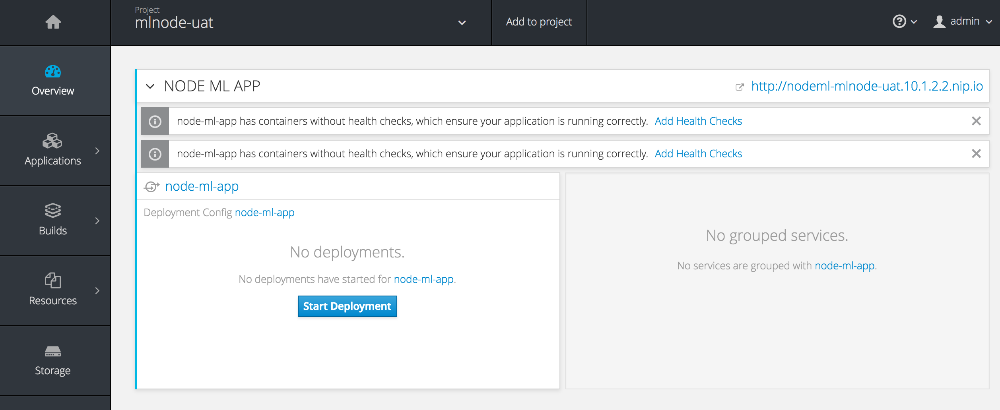

# How to Develop MarkLogic Applications in OpenShift

## Create DEV environment

### Create the template file node-ml.yml
```
apiVersion: v1
kind: Template
metadata:
  name: node-ml-template 
objects:
- apiVersion: v1
  kind: BuildConfig
  metadata:
    labels:
      app: node-ml
    name: node-ml
  spec:
    nodeSelector: null
    output:
      to:
        kind: ImageStreamTag
        name: node-ml-app:latest
    postCommit: {}
    resources: {}
    runPolicy: Serial
    source:
      contextDir: /
      git:
        ref: master
        uri: https://github.com/corpbob/devenvy.git
      type: Git
    strategy:
      sourceStrategy:
        from:
          kind: ImageStreamTag
          name: node-ml:latest
      type: Source
    triggers:
    - generic:
        secret: c072dc1951a36673
      type: Generic
    - github:
        secret: 50096e85258e03b9
      type: GitHub
    - imageChange: {}
      type: ImageChange
    - type: ConfigChange
- apiVersion: v1
  kind: DeploymentConfig
  metadata:
    labels:
      app: node-ml-app
    name: node-ml-app
  spec:
    replicas: 1
    selector:
      app: node-ml-app
      deploymentconfig: node-ml-app
    strategy:
      activeDeadlineSeconds: 21600
      resources: {}
      rollingParams:
        intervalSeconds: 1
        maxSurge: 25%
        maxUnavailable: 25%
        pre:
          execNewPod:
            command:
            - bash
            - ./SRC/DATA/integracheck/deploy.sh
            containerName: node-ml-app
          failurePolicy: Abort
        timeoutSeconds: 600
        updatePeriodSeconds: 1
      type: Rolling
    template:
      metadata:
        creationTimestamp: null
        labels:
          app: node-ml-app
          deploymentconfig: node-ml-app
      spec:
        containers:
        - image: 172.30.1.1:5000/mlnode/node-ml-app
          imagePullPolicy: Always
          name: node-ml-app
          ports:
          - containerPort: 3000
            protocol: TCP
          resources: {}
          terminationMessagePath: /dev/termination-log
        dnsPolicy: ClusterFirst
        restartPolicy: Always
        securityContext: {}
        terminationGracePeriodSeconds: 30
    test: false
    triggers:
    - type: ConfigChange
    - imageChangeParams:
        automatic: true
        containerNames:
        - node-ml-app
        from:
          kind: ImageStreamTag
          name: node-ml-app:latest
          namespace: mlnode
      type: ImageChange
- apiVersion: v1
  kind: ImageStream
  metadata:
    name: node-ml-app
  spec:
    tags:
- apiVersion: v1
  kind: Service
  metadata:
    labels:
      app: node-ml-app
    name: node-ml-app
  spec:
    ports:
    - name: 3000-tcp
      port: 3000
      protocol: TCP
      targetPort: 3000
    selector:
      app: node-ml-app
      deploymentconfig: node-ml-app
    sessionAffinity: None
    type: ClusterIP
- apiVersion: v1
  kind: Route
  metadata:
    annotations:
      openshift.io/host.generated: "true"
    creationTimestamp: null
    name: nodeml
  spec:
    host: nodeml-mlnode.10.1.2.2.nip.io
    port:
      targetPort: 3000-tcp
    to:
      kind: Service
      name: node-ml-app
      weight: 100
    wildcardPolicy: None
- apiVersion: v1
  kind: ImageStream
  metadata:
    name: node-ml
  spec:
    tags:
    - annotations:
        description: The Node ML Image
        tags: node-ml
      from:
        kind: DockerImage
        name: docker.io/bcorpusjr/node-ml
      importPolicy: {}
      name: latest
```
### Create project mlnode

```
oc new-project mlnode
```

## Import the template 

```
[root@ip-172-31-36-101 devenvy]# oc create -f node-ml.yml 
template "node-ml-template" created
```
## Create UAT Environment

- Create a template file named node-ml-uat.yml with the following contents

```
apiVersion: v1
kind: Template
metadata:
  name: node-ml-template 
objects:
- apiVersion: v1
  kind: DeploymentConfig
  metadata:
    labels:
      app: node-ml-app
    name: node-ml-app
  spec:
    replicas: 1
    selector:
      app: node-ml-app
      deploymentconfig: node-ml-app
    strategy:
      activeDeadlineSeconds: 21600
      resources: {}
      rollingParams:
        intervalSeconds: 1
        maxSurge: 25%
        maxUnavailable: 25%
        pre:
          execNewPod:
            command:
            - echo
            - "hello world"
            containerName: node-ml-app
          failurePolicy: Abort
        timeoutSeconds: 600
        updatePeriodSeconds: 1
      type: Rolling
    template:
      metadata:
        creationTimestamp: null
        labels:
          app: node-ml-app
          deploymentconfig: node-ml-app
      spec:
        containers:
        - image: 172.30.1.1:5000/mlnode/node-ml-app
          imagePullPolicy: Always
          name: node-ml-app
          ports:
          - containerPort: 3000
            protocol: TCP
          resources: {}
          terminationMessagePath: /dev/termination-log
        dnsPolicy: ClusterFirst
        restartPolicy: Always
        securityContext: {}
        terminationGracePeriodSeconds: 30
    test: false
    triggers:
    - type: ConfigChange
    - imageChangeParams:
        automatic: false
        containerNames:
        - node-ml-app
        from:
          kind: ImageStreamTag
          name: node-ml-app:latest
          namespace: mlnode
      type: ImageChange
- apiVersion: v1
  kind: ImageStream
  metadata:
    name: node-ml-app
  spec:
    tags:
- apiVersion: v1
  kind: Service
  metadata:
    labels:
      app: node-ml-app
    name: node-ml-app
  spec:
    ports:
    - name: 3000-tcp
      port: 3000
      protocol: TCP
      targetPort: 3000
    selector:
      app: node-ml-app
      deploymentconfig: node-ml-app
    sessionAffinity: None
    type: ClusterIP
- apiVersion: v1
  kind: Route
  metadata:
    annotations:
      openshift.io/host.generated: "true"
    creationTimestamp: null
    name: nodeml
  spec:
    host: nodeml-mlnode-uat.10.1.2.2.nip.io
    port:
      targetPort: 3000-tcp
    to:
      kind: Service
      name: node-ml-app
      weight: 100
    wildcardPolicy: None
- apiVersion: v1
  kind: ImageStream
  metadata:
    name: node-ml
  spec:
    tags:
    - annotations:
        description: The Node ML Image
        tags: node-ml
      from:
        kind: DockerImage
        name: docker.io/bcorpusjr/node-ml
      importPolicy: {}
      name: latest
```
Important: Take note that the imageChangeParams.automatic is false:

```
    - imageChangeParams:
        automatic: false
```

## Create a new project 

```
oc new-project mlnode-uat
```

## Save docker authentication information to be used when pulling the images from dev:

```oc secrets new-dockercfg pull-secret --docker-server=172.30.1.1:5000 --docker-username=admin --docker-password=$(oc whoami -t) --docker-email=admin@example.com
```

## Link this secret to the service account

```
oc secrets add serviceaccount/default secrets/pull-secret --for=pull
```
## Import the template node-ml-uat.yml

```
[root@localhost devenvy]# oc create -f node-ml-uat.yml 
template "node-ml-template" created
```

## Create the node-ml application

```
[root@localhost devenvy]# oc new-app node-ml-template
--> Deploying template "mlnode-uat/node-ml-template" to project mlnode-uat

--> Creating resources ...
    deploymentconfig "node-ml-app" created
    imagestream "node-ml-app" created
    service "node-ml-app" created
    route "nodeml" created
    imagestream "node-ml" created
--> Success
    Run 'oc status' to view your app.
```
You should see something like this:


